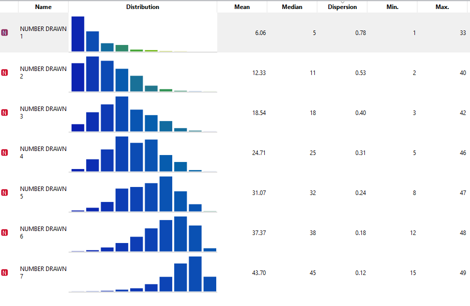

## TOY Case

The LOTTOMAX is the lottery game from Canada coordinated by the Interprovincial Lottery Corporation, as one of the country's three national lottery games. With its first draw occurring on September 25, 2009, the game replaced Lotto Super. ([*Wikipedia 2022*](https://en.wikipedia.org/wiki/Lotto_Max))

In order to try to understand their business rules and how the Toy Case behaved, I used the [*Orange Data Mining*](https://orangedatamining.com) tool to extract some insights.

Although the randomness of the numbers drawn is public knowledge, let's check some statistics to see if we can get some answers as to any trends.

According to an initial analysis, we observe the distribution going from left to right among the numbers drawn. This is because the numbers are registered in the results in an increasing order.

