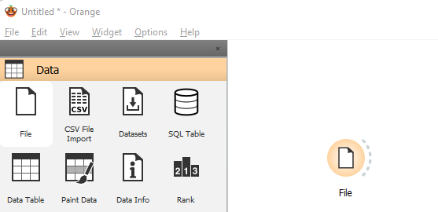
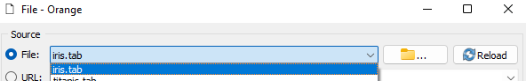
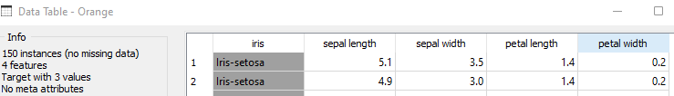
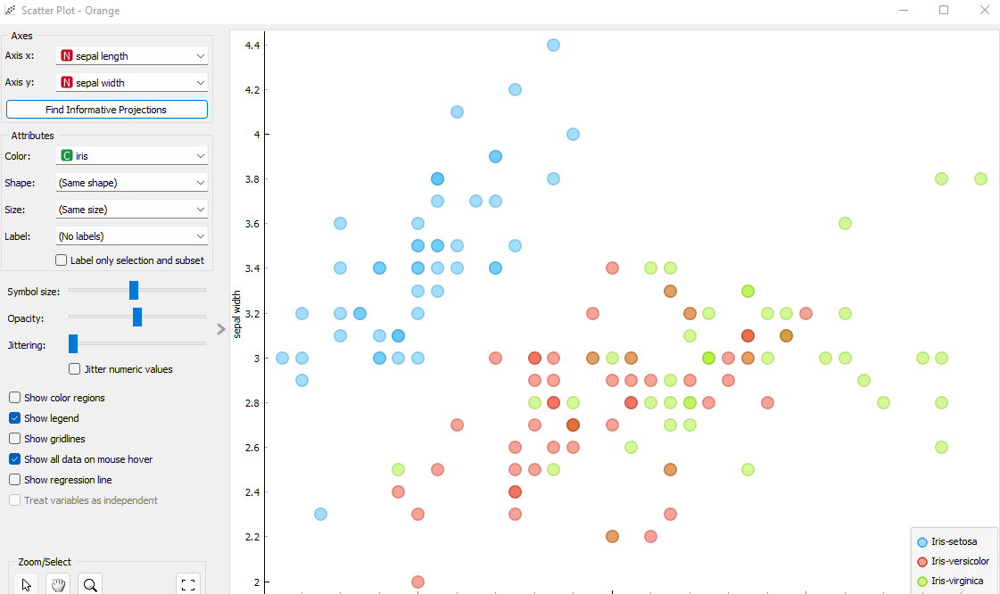

## Title: Orange, A powerful platform to perform data analysis and visualization

### How to start using Orange?

Once you've installed and opened the application, you can see the bunch of widgets available on the left side of the screen. To start click on the *File* widget, where you can load your date as the first node in the workflow.

It should apear in the canvas, double-click on it and select the option *iris.tab*.

Click on the *Data Table* widget, drag a line from the *File* widget to the left(input) side of the *Data Table* widget. Now, you can click and see the date from the iris dataset. :sparkles:

Let's select a ScatterPlot from the Visualize tab on the left side of the screen. Drag a line from the *File* simmilarly to what you did before with the *Data Table* widget. Click on ir and

VOILA!:tada: you finished your first workflow! :).

more at: https://www.youtube.com/playlist?list=PLmNPvQr9Tf-ZSDLwOzxpvY-HrE0yv-8Fy